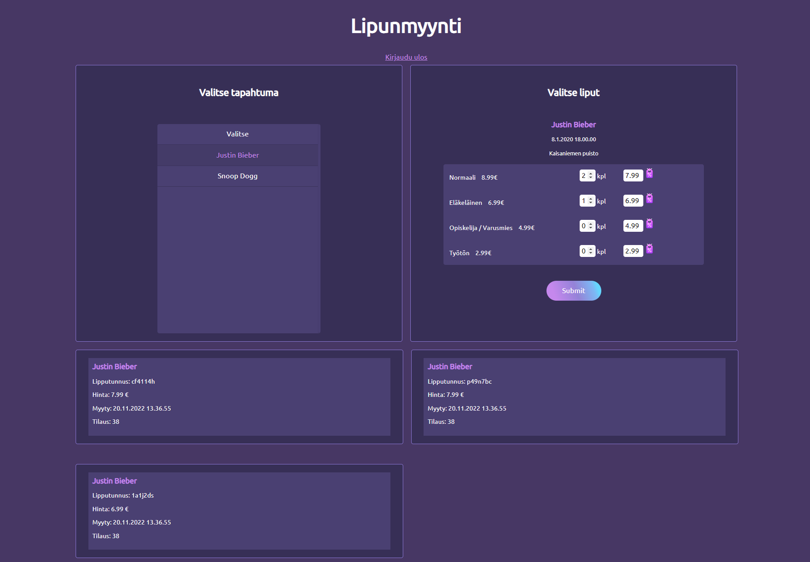

# Ticketguru Client

A simple client-side user interface for a group project. The server-side is made with Java Spring Boot.
The idea is that the system allows the user to sell tickets to customers for various events.

Includes following functions:

- Login

- Event selection

- Selection of ticket types and number of tickets

- Ticket printing

Technologies:
  

